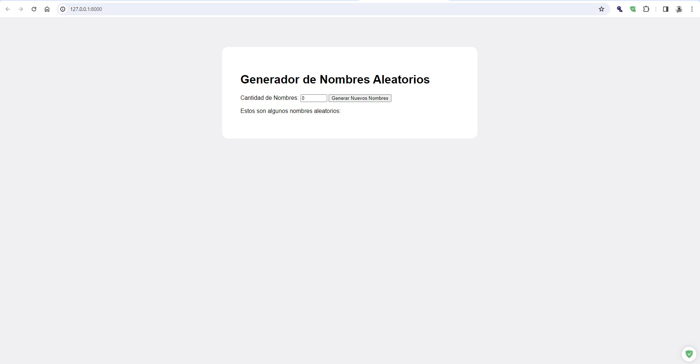
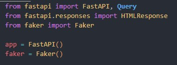

# FastAPiNames

A simple FastAPI implementation to generate a list of random names.

You can generate up to a maximum of 100 different names.

The reason why it could be achieved was thanks to the integration of the Faker library that helps us generate the random names

